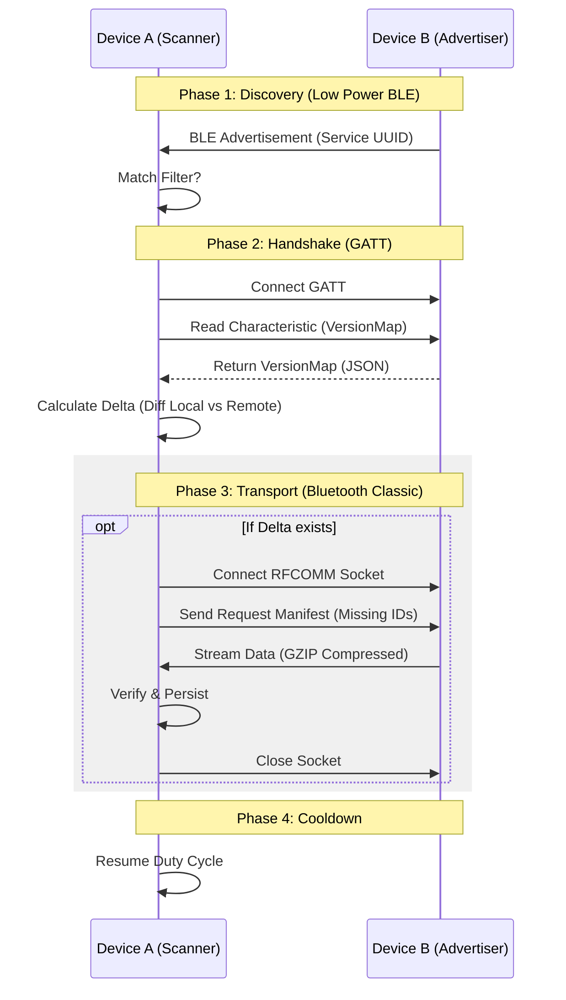
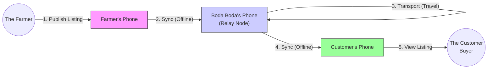

export const metadata = {
  title: 'SokoMesh: A Decentralized Offline-First Marketplace',
  description: 'White Paper & Technical Overview of an Android-based mobile application for offline commerce.',
  publishedAt: '2025-01-25',
}

<article className="font-sans prose prose-lg max-w-none prose-p:text-blue-900 prose-headings:text-blue-900 prose-headings:font-bold prose-a:text-blue-600 prose-a:no-underline hover:prose-a:underline prose-pre:bg-transparent prose-pre:p-0 prose-pre:m-0 prose-strong:text-blue-950 prose-li:marker:text-blue-500">

# SokoMesh: A Decentralized Offline-First Marketplace
## White Paper & Technical Overview

### 1. Executive Summary
**SokoMesh** (internal codename *SokoMesh*) is an Android-based mobile application designed to enable digital commerce in environments with limited, expensive, or nonexistent internet connectivity. By leveraging a custom peer-to-peer (P2P) mesh networking protocol, SokoMesh allows users to discover products, publish listings, and establish trust relationships entirely offline.

The system treats every device as a node in a localized ephemeral network. When devices come into physical proximity, they automatically exchange data ("gossip"), synchronizing their local databases. This "store-and-forward" architecture ensures that market information propagates through a community like a rumor, bridging the digital divide for last-mile commerce.

### 2. Problem Statement
In many emerging markets and remote communities:
*   **Connectivity is unreliable but commerce is constant.** Traders miss opportunities because they cannot share inventory digitally.
*   **Data is expensive.** Continuous server polling for a marketplace app consumes cost-prohibitive amounts of mobile data.
*   **Trust is local.** Centralized identity systems are often inaccessible; commerce relies on social reputation which doesn't translate easily to digital platforms.

### 3. Solution Architecture

SokoMesh implements a **Local-First, Offline-First** architecture where the device's local database is the primary source of truth. The "Cloud" is replaced by the collective storage of nearby peers.

#### 3.1. The "Smart Delta" Sync Protocol
The core innovation is a multi-stage sync protocol designed for energy efficiency and bandwidth optimization:

1.  **Discovery (BLE Advertising & Scanning)**
    *   Devices run a **Duty Cycle** (e.g., Scan 12s / Idle 3s) to conserve battery.
    *   Nodes advertise a Service UUID (`6e40...`) to signal participation.
    *   **Optimization**: To avoid connection overhead for outdated peers, devices broadcast their `databaseVersion` in the BLE Scan Response.

2.  **Handshake (GATT / Version Maps)**
    *   Upon discovery, a lightweight BLE GATT connection is established.
    *   Peer A reads Peer B's `VersionMap`—a compact vector clock summary of all data versions it holds (Listings and Trust Chains).
    *   **Delta Calculation**: Peer A compares the map against its local DB to determine exactly which items are missing or outdated.

3.  **Transport (Bluetooth Classic / RFCOMM)**
    *   If a delta exists (new data is available), the devices escalate the connection to a high-bandwidth **Bluetooth Classic Socket**.
    *   **GZIP Streams**: Data is compressed on the fly to maximize throughput.
    *   **Manifest Exchange**: Specific IDs are requested based on the Delta Calculation to ensure zero redundant data transfer.

#### 3.2. Data Models
*   **Listings**: Products defined by immutable IDs, signed by the owner's private key. Includes metadata (Price, Title) and rich media (Images, Voice Notes).
*   **Trust Graph**: A digital web-of-trust. Users sign "Vouchers" for others. These certificates sync alongside listings, allowing a buyer to verify a seller's reputation based on mutual connections, even without a central authority.
*   **Identity**: Public/Private key pairs generated locally on the device.

#### 3.3. Business Use Case: The Power of Relay
SokoMesh empowers communities by leveraging the natural movement of people to transport digital information. This "Store-and-Forward" capability allows a listing to travel from a remote farm to a bustling town without any internet connection.

**Scenario: The "Organic Tomatoes" Journey**
1.  **The Farmer**: Lives in a remote off-grid area. She posts "Organic Tomatoes" on SokoMesh.
2.  **The Boda Boda**: A boda boda rider who travels between the village and the town. He visits The Farmer's farm. His phone automatically syncs with The Farmer's, storing her listing.
3.  **The Customer**: Lives in the town. He is looking for fresh produce. When The Boda Boda arrives in town, The Customer's phone syncs with The Boda Boda's phone (the relay), discovering The Farmer's tomatoes.

### 4. Technical Specifications
*   **Platform**: Android (Kotlin)
*   **Local Database**: Room (SQLite)
*   **Connectivity Stack**:
    *   `BleManager`: Manages advertising, scanning, and GATT servers.
    *   `BluetoothClassicManager`: Manages RFCOMM secure sockets for bulk transfer.
    *   `MeshService`: Foreground service orchestrating the sync lifecycle.
*   **Security**: Ed25519 (inferred) or similar standard for signing content.

### 5. Potential Challenges & Risks

#### 5.1. Scalability of "Gossip"
*   **Issue**: As the number of listings grows, the `VersionMap` (list of all known versions) grows effectively linearly.
*   **Risk**: The `VersionMap` may eventually exceed the practical payload of a BLE GATT read operation, causing handshake failures or extreme latency.
*   **Mitigation**: Implement Merkle Trees orBloom Filters for more efficient state reconciliation.

#### 5.2. Battery Life
*   **Issue**: Continuous background scanning and maintaining a "Hot" Bluetooth radio drains the battery significantly.
*   **Risk**: Users may uninstall the app if it perceived as a battery hog.
*   **Mitigation**: Aggressive tuning of the Duty Cycle and "Backoff" strategies (scan less frequently if no peers found recently).

#### 5.3. Connection Stability (Android Fragmentation)
*   **Issue**: Android's Bluetooth stack varies by manufacturer. The "Too many register gatt interface" error is a common symptom of resource leaks or aggressive OS killing of background processes.
*   **Risk**: Flaky connections on low-end devices.
*   **Mitigation**: Robust "Watchdog" mechanisms (as seen in `MeshService`) and defensive resource cleanup logic.

#### 5.4. Trust & Spam
*   **Issue**: Without a central moderator, a malicious node can flood the mesh with fake listings or spam.
*   **Mitigation**: The Trust Graph is critical here. The UI must effectively filter content based on "Distance" in the trust graph (e.g., "Only show items from friends of friends").

### 6. Constraints & Assumptions

#### 6.1. Hardware Dependencies
*   **Android Only**: The current implementation relies on Android's specific Bluetooth APIs.
*   **Bluetooth Hardware**: Devices must support both Bluetooth Low Energy (BLE) (for discovery) and Bluetooth Classic (for high-bandwidth data transfer). Most modern smartphones support this, but very old low-end devices might lack full support.
*   **Storage**: The "Store-and-Forward" model assumes devices have sufficient local storage to mirror a relevant portion of the market database.

#### 6.2. Environmental Constraints
*   **Proximity**: Sync only happens when devices are physically close (typically < 10 meters).
*   **Density**: The mesh is effective only in areas with a critical mass of users or mobile "relay" nodes (e.g., public transport drivers). In extremely sparse populations without mobility, data propagation will stall.

#### 6.3. Security Assumptions
*   **Device Integrity**: We assume the local device is trusted by its owner. Physical access to a device implies access to its private keys unless biometric auth is layered on top.
*   **Trust Graph Validity**: The system relies on the assumption that the "Web of Trust" reflects real-world reputation. If an entire cluster of malicious nodes validates each other, they could theoretically create a "fake" trusted sub-graph.

### 7. Conclusion
SokoMesh represents a technical shift from "App-to-Server" to "App-to-App" communication. By solving the hard problems of offline data reconciliation and peer discovery, it unlocks a digital economy for the disconnected. The immediate focus should remain on stabilizing the Bluetooth mesh layer and optimizing the power/performance trade-off.

</article>
