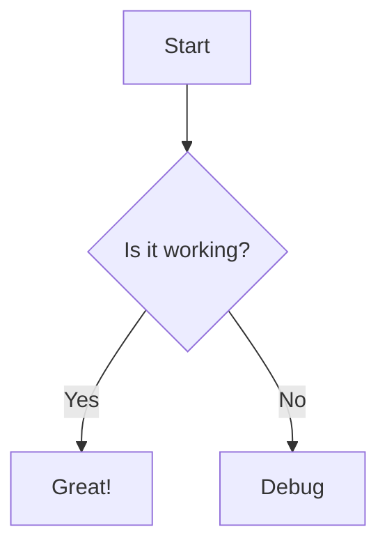
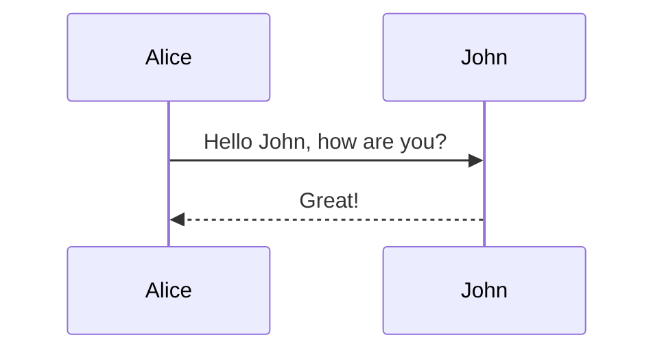

export const metadata = {
  title: 'Mermaid Test',
  description: 'Testing Mermaid to Excalidraw conversion',
  publishedAt: '2024-01-25',
}

# Mermaid Test

Here is a mermaid diagram:

And another one:

